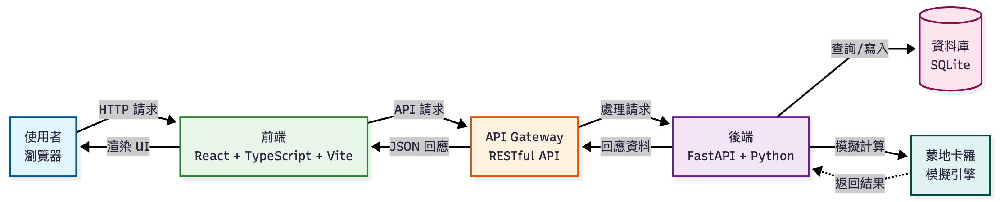

# Reveal.js 簡報使用說明

## 🚀 快速開始（推薦方式 - 使用 CDN）

### 優點：
- ✅ **不需要下載任何東西**
- ✅ **不需要安裝**
- ✅ **直接開啟即可使用**
- ✅ **自動使用最新版本**

### 步驟：

1. **開啟簡報檔案**
   ```bash
   # 直接在瀏覽器中開啟
   open presentation/index.html
   
   # 或使用 Python 本地伺服器（推薦，避免 CORS 問題）
   cd presentation
   python -m http.server 8000
   # 然後在瀏覽器開啟 http://localhost:8000
   ```

2. **開始編輯**
   - 直接編輯 `index.html` 檔案
   - 修改 `<section>` 標籤內的內容
   - 儲存後重新整理瀏覽器即可看到效果

3. **插入圖片**
   - 將 Draw.io 匯出的圖片放在 `images/` 資料夾
   - 在 HTML 中使用：``

---

## 📦 方式二：本地下載（如果需要離線使用）

### 如果需要離線使用或完整控制：

1. **下載 Reveal.js**
   ```bash
   cd presentation
   # 使用 npm 下載（需要 Node.js）
   npm install reveal.js
   
   # 或直接下載 ZIP
   # 訪問 https://github.com/hakimel/reveal.js/releases
   # 下載最新版本並解壓縮
   ```

2. **修改 HTML**
   ```html
   <!-- 將 CDN 連結改為本地路徑 -->
   <link rel="stylesheet" href="reveal.js/dist/reveal.css">
   <link rel="stylesheet" href="reveal.js/dist/theme/black.css">
   <script src="reveal.js/dist/reveal.js"></script>
   ```

---

## 📁 檔案結構

```
presentation/
├── index.html              # 簡報主檔案
├── images/                 # 圖片資料夾（需要建立）
│   ├── system-architecture.png
│   ├── monte-carlo-flow.png
│   └── business-model-canvas.png
└── README.md              # 本說明文件
```

---

## 🎨 自訂主題

### 可用的主題（CDN 版本）：
- `black.css` - 深色主題（預設）
- `white.css` - 淺色主題
- `league.css` - 深色主題（藍色調）
- `beige.css` - 淺色主題（溫和）
- `sky.css` - 藍色主題
- `night.css` - 深色主題
- `serif.css` - 襯線字體主題
- `simple.css` - 簡約主題
- `solarized.css` - Solarized 主題

### 切換主題：
```html
<!-- 在 index.html 中修改這行 -->
<link rel="stylesheet" href="https://cdn.jsdelivr.net/npm/reveal.js@4.3.1/dist/theme/black.css" id="theme">
<!-- 將 black 改為 white、league 等 -->
```

---

## ⌨️ 操作方式

- **下一頁**：按 `→` 或 `Space` 或點擊右側
- **上一頁**：按 `←` 或 `Shift + Space` 或點擊左側
- **全螢幕**：按 `F`
- **概覽模式**：按 `Esc`（顯示所有頁面）
- **講者備註**：按 `S`（開啟新視窗顯示備註）

---

## 🖼️ 插入圖片

### 1. 準備圖片
- 使用 Draw.io 匯出為 PNG（高解析度，建議 1920x1080 或更高）
- 或匯出為 SVG（向量圖，可縮放）

### 2. 放入資料夾
```bash
mkdir presentation/images
# 將圖片放入 images/ 資料夾
```

### 3. 在 HTML 中使用
```html
<section>
    <h2>系統架構</h2>
    
</section>
```

---

## 🎯 編輯簡報內容

### 新增頁面：
```html
<section>
    <h2>標題</h2>
    <p>內容</p>
</section>
```

### 居中對齊：
```html
<section class="center">
    <h1>標題</h1>
</section>
```

### 兩欄布局：
```html
<section>
    <div class="two-column">
        <div>左欄內容</div>
        <div>右欄內容</div>
    </div>
</section>
```

### 列表：
```html
<ul>
    <li>項目 1</li>
    <li>項目 2</li>
</ul>
```

### 程式碼：
```html
<pre><code>const example = "code";</code></pre>
```

---

## 🔧 進階設定

### 修改過渡效果：
```javascript
Reveal.initialize({
    transition: 'slide',  // slide, fade, none, zoom, convex, concave
});
```

### 加入背景音樂：
```html
<audio data-autoplay>
    <source src="audio/background.mp3" type="audio/mpeg">
</audio>
```

### 自訂 CSS：
在 `<style>` 標籤中加入自訂樣式：
```css
.reveal .slides section {
    /* 你的自訂樣式 */
}
```

---

## 📝 檢查清單

- [ ] 建立 `images/` 資料夾
- [ ] 將 Draw.io 圖表匯出並放入 `images/` 資料夾
- [ ] 修改 `index.html` 中的圖片路徑
- [ ] 編輯所有頁面內容
- [ ] 測試所有頁面是否正常顯示
- [ ] 測試圖片是否正常載入
- [ ] 測試鍵盤操作（← → Space Esc）
- [ ] 在不同瀏覽器測試（Chrome、Firefox、Safari）

---

## 🐛 常見問題

### Q: 圖片無法顯示？
A: 檢查圖片路徑是否正確，建議使用本地伺服器（`python -m http.server`）

### Q: 樣式沒有套用？
A: 確認 CDN 連結正確，檢查瀏覽器控制台是否有錯誤

### Q: 想要離線使用？
A: 下載 Reveal.js 並修改 HTML 中的路徑（見「方式二」）

### Q: 如何匯出為 PDF？
A: 使用瀏覽器列印功能（Cmd/Ctrl + P），選擇「另存為 PDF」

---

## 📚 參考資源

- [Reveal.js 官方文件](https://revealjs.com/)
- [Reveal.js GitHub](https://github.com/hakimel/reveal.js)
- [Reveal.js 範例](https://revealjs.com/examples/)

---

## 💡 提示

1. **使用本地伺服器**：避免 CORS 問題，建議使用 `python -m http.server`
2. **圖片格式**：PNG 適合照片，SVG 適合圖表（可縮放）
3. **圖片大小**：建議寬度不超過 1920px，檔案大小控制在 1MB 以內
4. **備份**：編輯前建議先備份原始檔案
# webapp_final_presentation
